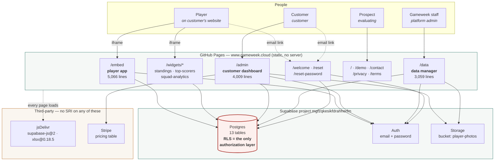
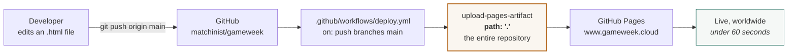
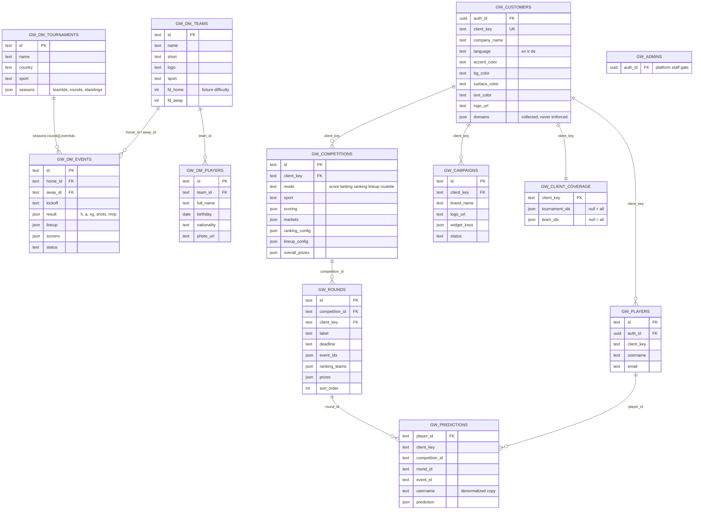
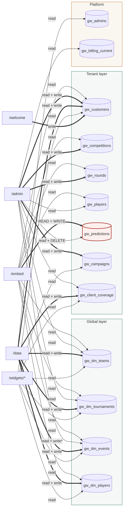
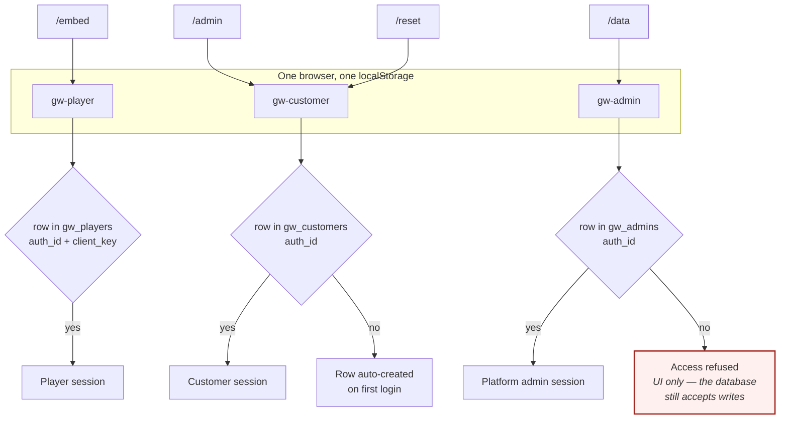
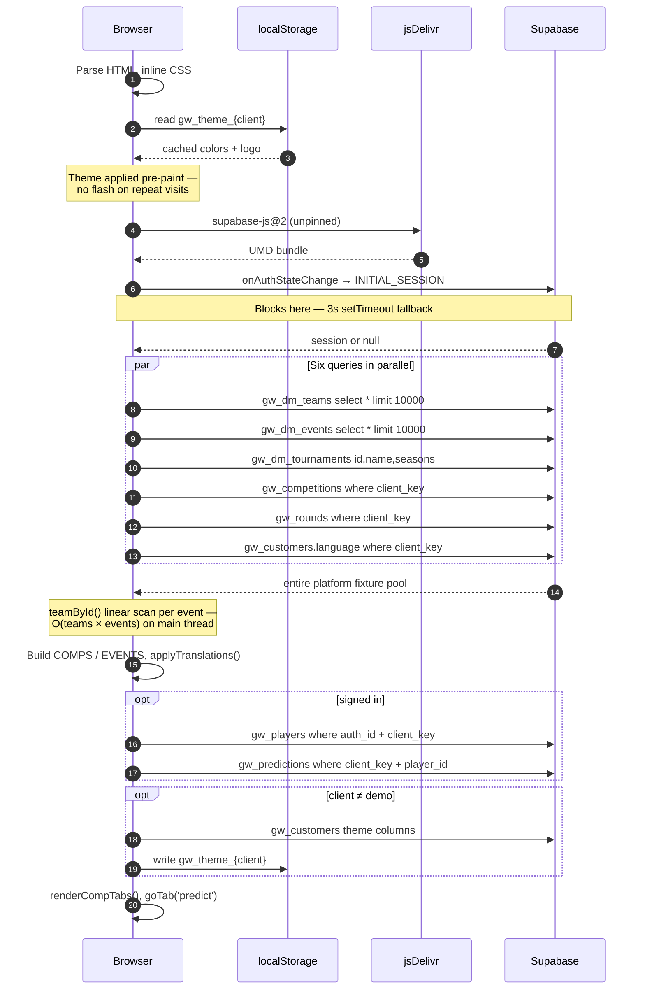
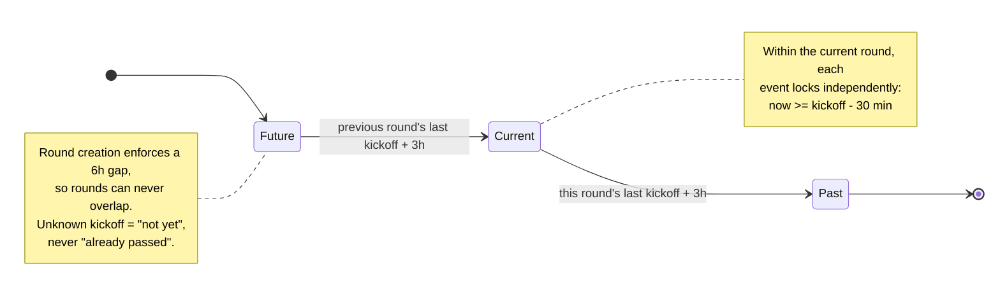
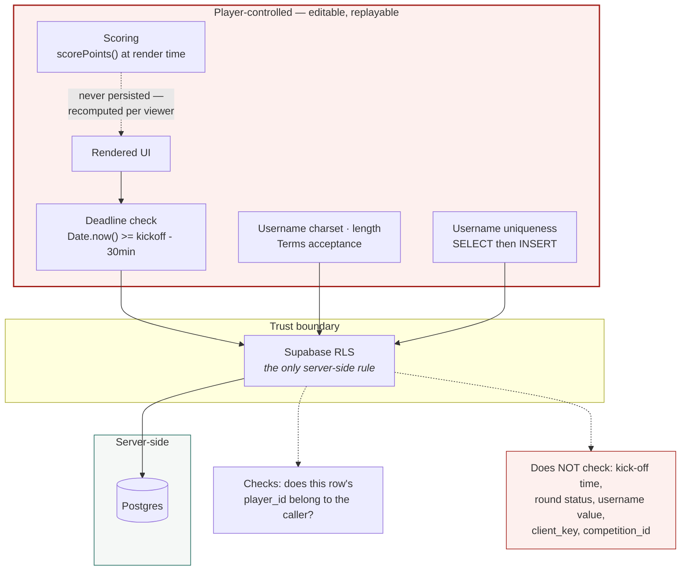

# Gameweek — Architecture

Diagrams of the system as traced at commit `f25d78a` (2026-08-27). Nothing here is aspirational — every edge was traced from the committed source, and the tables each surface touches were derived by enumerating its Supabase calls.

**Updated 2026-08-28:** §11 is an addendum covering everything that changed after the baseline (SSO Edge Function, seamless embed, private leagues, RLS PII fix, Portuguese). The diagrams in §1–§10 still describe the baseline; where a statement is no longer true, it links to §11.

Companion document: [CODEBASE-ASSESSMENT.md](./CODEBASE-ASSESSMENT.md).

---

## 1. System context

There is (almost — see [§11.1](#111-the-first-server-side-component-sso)) no application server. The static HTML pages are served from GitHub Pages; each one opens its own connection to Supabase from the browser using the public anon key.



**`/demo` is deliberately disconnected.** It runs entirely on hardcoded fixture data and never contacts Supabase, which is why it can be shown to a prospect with no account and no tenant.

---

## 2. Deployment



No build step, no tests, no staging, no preview, no approval gate. Rollback is `git revert && git push`.

Because the artifact is the whole repository, every tracked file is publicly served — including `supabase-migration.sql`, which is reachable at `https://www.gameweek.cloud/supabase-migration.sql` and discloses the full RLS policy set.

---

## 3. Data model

Two layers with different ownership, joined by a coverage table.



### Layer ownership

| Layer | Tables | Written by | Scoped by |
|---|---|---|---|
| **Global** | `gw_dm_teams`, `gw_dm_tournaments`, `gw_dm_events`, `gw_dm_players` | Gameweek staff, in `/data` | nothing — **no tenant key exists** |
| **Bridge** | `gw_client_coverage` | Gameweek staff, in `/data` | `client_key` |
| **Tenant** | `gw_customers`, `gw_competitions`, `gw_rounds`, `gw_players`, `gw_predictions`, `gw_campaigns` | Customers in `/admin`, players in `/embed` | `client_key` |
| **Platform** | `gw_admins`, `gw_billing_current` | out of band | — |

The global layer having no `client_key` is the root of the load problem in §6: a tenant's page cannot filter it in the database, so it downloads all of it.

---

## 4. Who touches what

Every edge below was derived by enumerating each file's `supa.from(...)` calls.



`gw_predictions` is the only table an unprivileged end user can write, which makes it the system's entire integrity surface.

\* `/admin` → `gw_dm_events` is the one edge that does not fire in practice. Its only write is `admin:1951`, which sits inside the result-entry modal that has no call site and would throw if it were reached — see §6.3 of the assessment. Customers cannot enter results; all fixture and result writes go through `/data`.

---

## 5. Session isolation

Each surface constructs its Supabase client with a distinct `storageKey`, so an customer who also plays on their own embed never has one session overwrite the other.



Accounts are **per-embed, not per-platform**: the same email registering on two customers' sites produces two separate `gw_players` rows against one Supabase Auth user. The `/data` gate is enforced in the page, not in the database.

---

## 6. Embed cold load



Steps 5–8 are serial and independent: the auth restore and the data load could run concurrently. Steps 9–14 fetch the whole platform's global data because those tables carry no tenant key.

---

## 7. Round and lock timing

Round state is **derived from real kick-off times**, not from the stored `round.status` — a deliberate choice, since the admin-set status can drift out of sync with reality.



| Rule | Value | Source |
|---|---|---|
| Event lock | kickoff − 30 min | `embed:3066`, `:3138`, `:4106`, `:4178` |
| Round advance | previous round's last kickoff + 3 h | `embed:1410` `computeCurrentRoundIdx` |
| Minimum round gap | 6 h, enforced at creation | `admin:2821` `validateRoundOverlap` |
| Fallback when no kickoff data | last round with `status === 'open'` | `embed:1429` `getDefaultRoundIdx` |

---

## 8. Where rules are enforced

The same picture as §1, drawn by trust boundary rather than by component. Everything inside the dashed box runs on hardware the player controls.



Every rule that makes the game a game currently lives in the untrusted box. `gw_predictions` accepts a write from any authenticated player at any time, and points are recomputed from that row by every other player's browser. See [§4.1 of the assessment](./CODEBASE-ASSESSMENT.md) for the consequence and the fix.

---

## 9. Embed URL contract

```
https://www.gameweek.cloud/embed?client=<client_key>&comp=<id,id,...>
```

| Parameter | Required | Effect |
|---|---|---|
| `client` | no — defaults to `demo` | Selects the tenant. Drives theme, language, competitions, player scope. |
| `comp` | no | Comma-separated competition IDs. Narrows the embed; when it resolves to exactly one, the competition tab strip is hidden. An unmatched value renders a "competition not found" state. |

Widgets take `client`, and `standings` additionally accepts `tournament` and `season`. The customer copies the generated `<iframe>` from `/admin` → Embed.

---

## 10. File map

| Path | Lines | Talks to Supabase | Notes |
|---|---:|---|---|
| `embed/index.html` | 5,066 | yes — 8 tables | The product |
| `demo/index.html` | 4,289 | **no** | Hardcoded data; hand-maintained fork of `embed` |
| `admin/index.html` | 4,009 | yes — 10 tables | Customer dashboard |
| `data/index.html` | 3,059 | yes — 7 tables | Platform data manager; the only place results are entered |
| `index.html` | 517 | no | Marketing homepage; JSON-LD, GA |
| `cs2fantasy/index.html` | — | no | **Orphaned** — unlinked, crawlable |
| `widgets/squad-analytics/` | — | yes — 5 tables | Embeddable |
| `widgets/top-scorers/` | — | yes — 5 tables | Embeddable |
| `widgets/standings/` | — | yes — 4 tables | Embeddable, renders sponsor banner |
| `welcome/index.html` | — | yes — writes `gw_customers` | Post-signup setup |
| `reset-password/index.html` | — | auth only | The live reset target |
| `reset/index.html` | — | auth only | **Orphaned** — superseded |
| `pricingtest/index.html` | — | no | **Orphaned** — the only page with prices |
| `contact/` `privacy/` `terms/` | — | no | Static |
| `supabase-migration.sql` | — | — | Stale, destructive, **publicly served** |
| `llms.txt` | — | — | Product summary for AI answer engines |

---

---

## 11. Addendum — changes since `f25d78a` (as of `a06b055`, 2026-08-28)

Thirteen commits landed after the baseline. Four of them change the architecture materially.

### 11.1 The first server-side component: SSO

`supabase/functions/sso-login/index.ts` is a Supabase Edge Function — the repository's first and only trusted server-side code. It verifies an HMAC-SHA256 signature made with the customer's `sso_secret` and mints a real Supabase session for a **synthetic** auth user (`sso-…@sso.gameweek.cloud`), so players already signed in on the customer's site (e.g. Shopify) enter the game without registering. Deployed manually (`supabase functions deploy sso-login`), not by the Pages workflow.

Full design: [SSO.md](./SSO.md). Two structural consequences:

- The sentence "there is no server" in §1 is no longer strictly true — and the Edge Function pattern is now *proven* in this codebase, which matters for the target architecture.
- SSO couples the product to Supabase GoTrue specifically (synthetic users, `generateLink` + `verifyOtp`). Any future auth migration must re-implement this flow.

### 11.2 Seamless script embed

`embed.js` (repo root) is a loader customers paste instead of a fixed-height iframe. It injects `/embed?…&inline=1`, receives content-height reports by `postMessage`, streams the visible viewport band back (`--gw-vt`/`--gw-vh` pin overlays), and forwards the SSO identity. The postMessage protocol (`height`, `scroll-top`, `viewport`, `sso`) is now a **public integration contract** — customers embed this script once and never update it, so it must stay backwards-compatible.

### 11.3 RLS lockdown of PII (applied and verified in production)

The assessment's C-3 (player emails world-readable) was confirmed live — and worse: `gw_customers` also leaked `email` and Stripe IDs to the anon key. Fixed 2026-08-28 and verified in production:

- `gw_customers_public` — a security-definer view exposing only branding columns (+ `domains` for the SSO origin check). The embed and standings widget now read branding from it.
- Base tables `gw_customers` / `gw_players` locked to owner + platform admins; all anon access revoked.
- `supabase-migration.sql` updated to match; standalone idempotent version in `supabase-rls-pii-fix.sql` (parts a/b for zero-downtime order).
- New unique index `gw_players(client_key, username)` closes the username TOCTOU race.

§8's trust-boundary picture improves accordingly: identity *data* is now protected. The game-integrity gaps (deadline, scoring, world-readable predictions, globally-writable `gw_dm_*`) are unchanged.

### 11.4 Private leagues — two new tables, no committed RLS

Players can create/join/leave private leagues (`4b0aad9`), client-wide across modes:

| Table | Columns (from code) | Concern |
|---|---|---|
| `gw_leagues` | `id`, `client_key`, `name`, `code`, `created_by` (username) | Created ad hoc in the SQL editor — **no RLS definition exists in the repo** |
| `gw_league_members` | `league_id`, `username` | Membership keyed on **username**, not `player_id` — inherits every fragility §5.3 of the assessment describes |

League names are escaped on render (`escapeHtmlLineup`) — the new code has better XSS hygiene than the leaderboard path it sits next to.

### 11.5 Smaller changes

- **Portuguese** (`pt`) added — four languages now, not three.
- Admin: tournament picker + automated round creation (copies rounds from the Data Manager); rounds that haven't started yet are blocked from predictions.
- **New publicly served files** (deploy uploads the whole repo): `sso-test.html`, `supabase-sso.sql`, `supabase-rls-pii-fix.sql` (+ `.part-a`/`.part-b`). The assessment's M-2 (policy roadmap served to attackers) now covers five SQL files and a test harness.
- File sizes at `a06b055`: `embed` 5,747 lines (was 5,066), `demo` 4,458, `admin` 4,287, `data` 3,059. The duplicate function definitions (H-1) are still present, now at `embed:3116`/`:4201`, `:3417`/`:4463`, `:3431`/`:4477`.

---

*Traced from the repository at `f25d78a`; addendum §11 reflects `a06b055` (2026-08-28). Table access was derived by enumerating `supa.from(...)` calls per file; RLS behaviour is inferred from `supabase-migration.sql` plus the applied `supabase-rls-pii-fix.sql`, and for `gw_customers`/`gw_players` was verified against production. Line numbers in §1–§10 refer to the baseline commit.*
