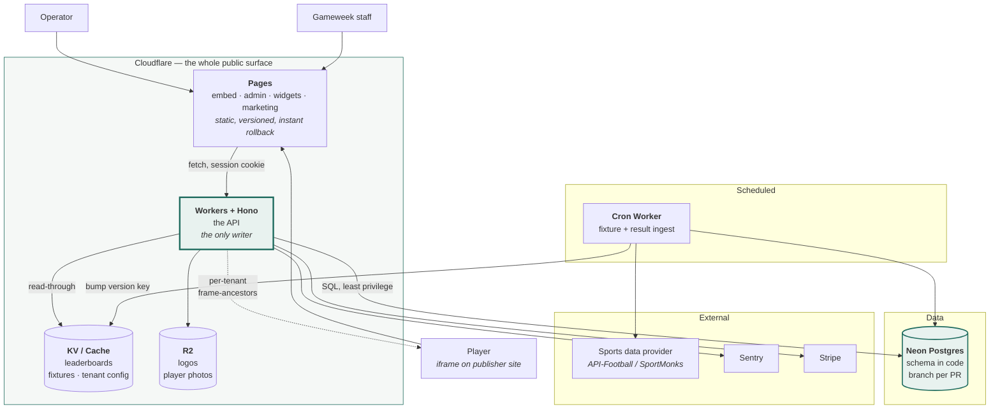
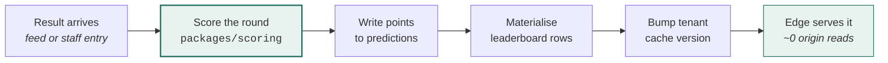
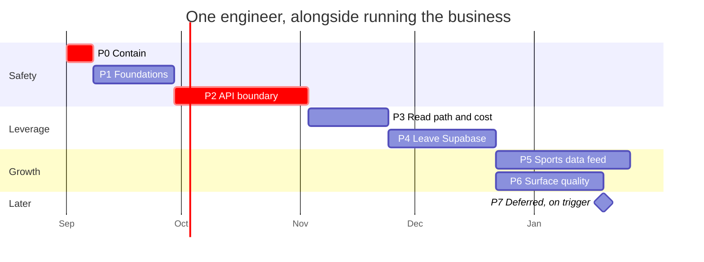

# Gameweek — Target Architecture & Phased Plan

**Status:** proposal · **Date:** 2026-08-27 · **Baseline:** `f25d78a`
**Companion docs:** [CODEBASE-ASSESSMENT.md](./CODEBASE-ASSESSMENT.md) · [ARCHITECTURE.md](./ARCHITECTURE.md)

> Nothing in this document has been implemented. It is a plan.

---

## 1. The thesis in one paragraph

Gameweek does not need a rewrite. It needs **one thing it has never had: a server**. Every critical finding in the assessment — cheatable predictions, exposed player emails, a globally-writable sports database, stored XSS — is the same root cause wearing different clothes: there is no trusted place to enforce a rule. Adding a thin API layer between the browser and the database closes all of them at once, and it is also the precondition for every other improvement on the list: tenant-scoped queries, cached leaderboards, a real test suite, and leaving Supabase. So the plan is built around that single change, with everything else sequenced before it (to make it safe) or after it (because it becomes possible).

The second insight is that **leaving Supabase is not a migration — it is a peeling**. Supabase is five products bolted together: Postgres, PostgREST, GoTrue (auth), Storage, and Edge Functions. Gameweek uses four of them. Because the database underneath is ordinary Postgres, each layer can be removed independently, in any order, with the database staying exactly where it is until the very last step — at which point moving it is a `pg_dump`. That turns a scary big-bang migration into five small reversible ones.

---

## 2. Design principles

These are constraints, not aspirations. Every decision below was tested against them.

| # | Principle | Why it binds here |
|---|---|---|
| P1 | **One engineer must be able to operate the whole thing on a Sunday.** | 466 of 467 commits are by one person. Anything requiring a second pair of hands to keep alive is disqualified. |
| P2 | **Infrastructure cost per tenant must round to zero.** | Revenue is capped at **$150/month per operator**. Any vendor priced per-MAU or per-seat can outgrow revenue. This single fact disqualifies Clerk, Auth0, and most observability SaaS at their paid tiers. |
| P3 | **Never break a live customer.** | Real operators are running competitions today. Every phase ships behind a flag, endpoint by endpoint, and is reversible in one deploy. |
| P4 | **Trust nothing the player can edit.** | The player's browser is not a place where rules live. It is a rendering surface. |
| P5 | **Prefer boring, portable technology.** | Postgres, TypeScript, HTTP, SQL. No technology whose failure mode requires a specialist. |
| P6 | **Every layer removed is worth more than every layer added.** | The current system's problem is not that it lacks components — it's that it lacks a boundary. |
| P7 | **Defer enterprise concerns explicitly, with a named trigger.** | Not "later" — "when X happens". See §11. |

---

## 3. Target architecture



### What each piece is for

| Component | Choice | Job |
|---|---|---|
| Static hosting | **Cloudflare Pages** | Serves the four SPAs. Gives response headers (CSP, HSTS), preview deploys per PR, and one-click rollback — none of which GitHub Pages can do. |
| API | **Hono on Cloudflare Workers** | The trust boundary. Every write, and every read that needs tenant scoping. Sub-ms cold start, global, ~$5/mo. |
| Database | **Neon Postgres** | Same engine as today, so no data migration. Branch-per-PR gives real integration tests against real Postgres. |
| ORM / migrations | **Drizzle + drizzle-kit** | Schema is TypeScript, migrations are versioned files, runs on Workers. Replaces a stale SQL file with a real history. |
| Auth | **Better Auth**, self-hosted on our Postgres | Users live in our database. No per-MAU billing (P2). Supports the tenant-scoped identity model we actually need. |
| Cache | **Workers KV**, versioned keys | Leaderboards and fixture lists served from the edge. This is where per-tenant cost collapses. |
| Object storage | **Cloudflare R2** | Zero egress fees — matters for logos loaded on every embed render. |
| Frontend build | **Vite + TypeScript** | Lets us split the 5,000-line files into modules and share code between `embed` and `demo`. No framework. |
| Monorepo | **pnpm workspaces** | The point is `packages/scoring` — one scoring engine, used by both server and client. |
| Tests | **Vitest** + `@cloudflare/vitest-pool-workers` + **Playwright** | Unit on pure logic, integration against real Postgres, E2E on the one flow that matters. |
| Errors | **Sentry** (free tier) | Currently there is no way to know the embed broke. |

### Repository shape

```
apps/
  embed/          player app          (Vite + TS)
  admin/          operator dashboard  (Vite + TS)
  data/           staff data manager  (Vite + TS)
  widgets/        embeddable widgets  (Vite + TS)
  marketing/      static pages
  api/            Hono on Workers     ← the new thing
packages/
  scoring/        pure scoring engine, shared by api + embed
  schema/         Drizzle schema + migrations
  contracts/      Zod schemas → request/response types + OpenAPI
  theme/          gwReadableText / gwApplySemantics, extracted as-is
```

`packages/scoring` is the most important line in that tree. Today scoring logic exists twice in `embed` (`:3049` and `:4089`) and again in `demo`, is untestable, and runs only in the browser. Extracted, it becomes one pure, unit-tested module that the server runs authoritatively and the client runs optimistically for instant feedback — same code, one source of truth.

---

## 4. The three mechanisms that fix everything

Most of the plan is plumbing. These three are the substance.

### 4.1 The atomic, server-enforced write

Today a prediction is an `upsert` from the browser with no time check. Tomorrow it is a single statement whose `WHERE` clause makes a late write impossible — using **database time**, not application time, so clock skew and a lying client are both irrelevant:

```sql
INSERT INTO predictions (player_id, round_id, event_id, prediction, tenant_id)
SELECT $1, $2, e.id, $3, $4
FROM   events e
WHERE  e.id = $2
  AND  e.kickoff > now() + interval '30 minutes'
ON CONFLICT (player_id, competition_id, event_id) DO UPDATE
  SET prediction = excluded.prediction
RETURNING id;
```

Zero rows returned means the deadline passed — the API returns `409`, the UI says so. There is no code path, from any client, that writes a late prediction. This is finding **C-1**, closed structurally rather than by validation.

The same shape handles the rest: `username` gets a `CHECK` constraint (C-4 at the source), `tenant_id` becomes immutable via trigger (H-7), and `points` becomes a column the client cannot write.

### 4.2 Scoring becomes a stored fact

Today points are recomputed in every viewer's browser, every render, from raw predictions. That makes leaderboards uncacheable, unauditable, and — combined with 4.1's absence — forgeable.

New pipeline:



Run it inline in the ingest request to begin with. Move it to Cloudflare Queues only when a single round's scoring exceeds the request budget — not before.

Auditability comes free: a stored `points` value with the raw prediction beside it means a disputed leaderboard can be explained from the data, and a scoring-rule change doesn't silently rewrite history.

### 4.3 Versioned cache keys instead of purging

Cache-tag purging is a Cloudflare Enterprise feature. The startup-grade equivalent costs nothing and works just as well:

```
key = leaderboard:{tenant}:{competition}:{round}:v{version}
```

`version` is an integer on the tenant row, bumped on any write that invalidates reads. New reads miss and repopulate; old keys age out on TTL. No purge API, no Enterprise plan, no stale data.

This is what turns the current cost curve around. Today every embed pageview hits Postgres for the entire platform's fixture table (finding H-2). After this, a popular round is one origin read serving thousands of viewers from ~300 edge locations.

---

## 5. Key decisions, and what was rejected

| # | Decision | Rationale | Rejected alternative |
|---|---|---|---|
| D1 | Keep Postgres; peel off the Supabase platform | Supabase *is* Postgres. Keeping it makes the exit incremental instead of a big bang. | Full migration to a new datastore — needless risk, no benefit. |
| D2 | Introduce an API layer before anything else | No client-side rule is enforceable. Every critical finding traces here. | More RLS policies — RLS can express "whose row is this", not "is it before kick-off". |
| D3 | Cloudflare Workers over a container PaaS | Read traffic is global iframe traffic; edge is where it should be served. No idle cost, no cold-start tax. | Fly.io / Railway — fine, but pays for idle and puts the API in one region while readers are worldwide. |
| D4 | Neon over D1 / PlanetScale | Postgres wire compatibility means *zero data migration*. Branch-per-PR gives real test databases. | D1 (SQLite; JSON-heavy model and write concurrency are a poor fit), PlanetScale (MySQL = a real migration). |
| D5 | Drizzle over Prisma | Runs on Workers without a query engine binary; SQL-first, so the atomic write in §4.1 is expressible. | Prisma — heavier, historically awkward on edge runtimes. |
| D6 | **Self-hosted auth (Better Auth), not a vendor** | **P2.** Clerk/Auth0 price per monthly active user. Revenue is capped at $150/operator/month. At platform scale, auth billing could exceed revenue. This is a business constraint, not a preference. | Clerk, Auth0, WorkOS — architecturally disqualified by the pricing model. Staying on GoTrue — keeps the Supabase dependency we're removing. |
| D7 | No frontend framework yet | The embed must stay small and load fast inside someone else's page. A bundler alone unlocks modules, TypeScript, and code sharing. | React/Next — bundle cost and a rewrite, for no capability we currently need. |
| D8 | Monorepo, pnpm workspaces | Justified almost entirely by `packages/scoring`. Add Turborepo only when builds get slow. | Separate repos — reintroduces the `embed`/`demo` drift we're fixing. |
| D9 | REST + Zod + generated OpenAPI | Typed end-to-end without lock-in, and it doubles as a partner API later — a plausible revenue line. | GraphQL (needless complexity at this size), tRPC (couples clients to the server's TypeScript). |
| D10 | Ship RLS as defence-in-depth, not primary authz | Once the API is the only client, RLS becomes a second lock, not the only one. Keep it; stop relying on it. | Dropping RLS entirely — loses a free safety net. |

---

## 6. Tooling: today → target

| Concern | Today | Target | Urgency |
|---|---|---|---|
| Static hosting | GitHub Pages | Cloudflare Pages | Phase 1 |
| Build | none | Vite + TypeScript | Phase 1 |
| Package manager | none | pnpm workspaces | Phase 1 |
| API | **none** | Hono on Workers | **Phase 2** |
| Database | Supabase Postgres | Neon Postgres | Phase 4 |
| Schema management | one stale, destructive `.sql` | Drizzle migrations | Phase 1 |
| Auth | Supabase GoTrue | Better Auth | Phase 4 |
| File storage | Supabase Storage | Cloudflare R2 | Phase 4 |
| Data access | PostgREST from the browser | API only | Phase 2–3 |
| Caching | none | Workers KV, versioned keys | Phase 3 |
| Tests | **none** | Vitest + Playwright | Phase 1 |
| CI | none | GitHub Actions | Phase 1 |
| Error tracking | **none** | Sentry | Phase 1 |
| Secrets | hardcoded anon key | Wrangler secrets | Phase 2 |
| Sports data | manual typing | provider feed | Phase 5 |

---

## 7. The phases

Effort is in **developer-weeks for one engineer**, assuming the business keeps running alongside.

---

### Phase 0 — Contain · ~1 week

Stop what is currently exploitable. No architecture change, nothing that can break a customer.

- Audit live RLS (`select * from pg_policies`); commit the real state as the baseline.
- Drop `players_read_public`; leaderboards already read `username` off predictions.
- Restrict `gw_dm_*` writes to `gw_admins` membership.
- Escape `${row.u}` at `embed:4681`; add a `CHECK` constraint on `username`.
- Make `client_key` immutable; restrict `players_update_own` columns.
- Remove `supabase-migration.sql` from the deployed artifact.
- Pin `supabase-js`; add SRI to CDN scripts.
- Confirm the Stripe test-mode key is intentional.
- Delete the duplicate function definitions in `embed` and `admin`.

**Exit:** no finding rated Critical remains exploitable from a browser.
**Rollback:** each item is a one-line revert.
**Risk:** low. Dropping the public read policy is the only one that can break a page — verify the leaderboard first.

---

### Phase 1 — Foundations · ~3 weeks

Everything Phase 2 depends on. Deliberately no behaviour change: the app should look and work identically at the end of this phase.

- **pnpm workspaces**, repo restructured into `apps/` + `packages/`.
- **Vite + TypeScript** per app. Start with `allowJs`, no strict mode — the goal is a build, not a rewrite.
- **Extract `packages/scoring`** from the surviving `embed` implementations. Write its unit tests first; this is the highest-value test suite in the codebase.
- **Extract `packages/theme`** — `gwLum`/`gwContrast`/`gwReadableText`/`gwApplySemantics` move over unchanged. They are already good.
- **Kill the `demo` fork.** Demo becomes `embed` with a mock data adapter. This deletes ~4,000 lines of drifting duplicate and closes finding M-3 permanently.
- **Cloudflare Pages** replaces GitHub Pages: security headers, per-PR previews, instant rollback.
- **Drizzle introspect** the live database → committed schema + a baseline migration.
- **CI**: typecheck, unit tests, build, and a duplicate-declaration check.
- **Sentry** in all four apps.

**Exit:** `pnpm test` runs green in CI; every PR gets a preview URL; production rolls back in one click; the scoring engine has >90% coverage.
**Effort:** the demo consolidation is the bulk of it.
**Risk:** medium — this touches every file. Mitigated by shipping behind Pages previews and comparing against production before promoting.

---

### Phase 2 — The API boundary · ~5 weeks

**The phase that matters.** Everything before it was preparation; everything after depends on it.

- `apps/api` — Hono on Workers, Zod-validated, OpenAPI generated.
- Session auth: httpOnly cookie scoped to the tenant, replacing the anon key in the browser.
- **Tenant-scoped identity**: `(tenant_id, email)` unique. This removes the cross-tenant enumeration oracle where a login error reveals that an email exists on another publisher's property.
- Move writes across, one endpoint at a time behind a flag:
  1. `POST /predictions` — with the atomic guard from §4.1
  2. `POST /auth/register`, `/auth/login` — server-side validation
  3. `POST /admin/competitions`, `/rounds`, `/results`
- **Revoke anon write access** on every table once its endpoint is live.
- Per-tenant `Content-Security-Policy: frame-ancestors` from the operator's `domains` list — the allowlist finally does something (H-3), and this is only possible because we left GitHub Pages.
- Rate limiting on auth and prediction endpoints.
- Integration tests against a real Neon branch in CI.

**Exit:** the anon key can write nothing. A late prediction returns `409` from the API and there is no path around it.
**Risk:** high — this is the live prediction path. Mitigated by the strangler pattern: run both paths, dual-write, compare, then cut over per endpoint.
**Rollback:** flip the flag back per endpoint.

---

### Phase 3 — Read path & cost · ~3 weeks

Now that reads can be tenant-scoped, fix the load problem and the cost curve.

- Tenant-scoped read endpoints; the browser stops touching Postgres entirely.
- **Fix H-2 properly**: fetch only events this tenant's rounds reference, plus the fixture list for lineup-mode teams. Replace the `teamById` linear scan with a `Map`. Select explicit columns.
- Materialised leaderboards + stored `points` (§4.2).
- Versioned KV cache (§4.3) for leaderboards, fixtures, and tenant config.
- Paginate leaderboards.
- Parallelise the embed's serial init; drop the 3-second auth wait.

**Exit:** an embed cold load pulls only its own tenant's data; a cached leaderboard serves with zero origin reads; p75 load measurably better than baseline.
**Business impact:** this is where gross margin stops degrading as customers are added.

---

### Phase 4 — Leave Supabase · ~4 weeks

Safe now, because the API is the only consumer. Four independent, individually reversible steps.

1. **Storage → R2.** Copy `player-photos`, dual-read, cut over. Zero egress fees.
2. **Auth → Better Auth** on the same Postgres. Migrate users; passwords are bcrypt-compatible, so no forced reset. Run both verifiers during a grace window.
3. **Postgres → Neon.** `pg_dump` / `pg_restore` into a Neon branch, replay, verify row counts, repoint the API's connection string. The only user-visible moment is a short write freeze.
4. **Delete the Supabase project** once nothing references it for 30 days.

**Exit:** no Supabase dependency in any `package.json`, `wrangler.toml`, or HTML file.
**Risk:** medium, concentrated in step 2. Auth migration is the one place to be slow and careful.
**Rollback:** steps 1–2 dual-run; step 3 keeps the Supabase database read-only for 30 days.

---

### Phase 5 — Remove the human bottleneck · ~5 weeks

The largest constraint on the business is not the code — it is that every fixture and result for every customer is typed in by hand. Until this phase, growth means hiring data-entry staff.

- Integrate a sports data provider (**API-Football** or **SportMonks** — both are startup-priced; Sportradar is not).
- Cron Worker: fixture sync, result ingest, lineup and scorer ingest.
- Reconciliation UI for staff — review and override, not retype.
- **Let operators enter results for their own competitions**, and delete the dead admin modal (H-4).
- Keep manual entry as the fallback for sports the feed doesn't cover.

**Exit:** football results land without a human. Onboarding a new operator does not add data-entry load.

---

### Phase 6 — Product surface quality · ~4 weeks, parallelisable

Deferred this far because it is not blocking, not because it is optional. Accessibility in particular carries real exposure — the customers are EU/UK publishers who will pass their obligations down.

- Accessibility pass on `embed`: landmarks, labels, focus traps in modals, keyboard reachability, `lang` per language, reduced-motion, a non-colour channel for correct/incorrect.
- GDPR: account deletion, data export, consent timestamping with policy version.
- SEO: metadata on `/demo`, `noindex` or delete the orphan pages, fix the sitemap.
- Mode registry replacing scattered `mode === 'x'` branching; delete the `lms`/`fantasy`/`matchups` paths.
- i18n completeness: translate `roulette`, localise dates, add a language without touching four files.

---

### Phase 7 — Deferred until triggered

Planned, costed, and explicitly **not now**. Each has a named trigger so the decision gets revisited on evidence rather than anxiety.

| Capability | Build it when | Rough cost |
|---|---|---|
| SOC 2 Type II | A named enterprise deal requires it | 3–6 months + $20–40k |
| SSO / SAML for operators | Three operators ask | 2–3 weeks |
| Multi-region database | p95 read latency outside Europe becomes a complaint | 2 weeks (Neon read replicas) |
| Queues + event-driven scoring | A round's scoring exceeds the request budget | 1 week |
| Data warehouse + BI | Product analytics questions can't be answered from Postgres | 2 weeks |
| On-call rotation, runbooks, SLOs | Second engineer joins | 1 week |
| Audit log | An operator disputes a leaderboard, or compliance asks | 1 week |
| Partner/public API | An operator asks to pull their own data | 2 weeks — mostly done, OpenAPI already generated |
| Kubernetes, microservices, service mesh | **Probably never.** Revisit above ~50 engineers. | — |

---

## 8. Finding coverage

Every finding from the assessment, mapped to the phase that closes it.

| Phase | Closes |
|---|---|
| **0 — Contain** | C-2, C-3, C-4 (partial), C-5, H-1, H-5, H-7, M-2, M-8 |
| **1 — Foundations** | M-1, M-3, M-14, L-1, L-2, L-6 |
| **2 — API boundary** | **C-1**, C-4 (fully), H-3, H-6, M-15 (partial) |
| **3 — Read path** | H-2, M-10, and the §7.4 margin problem |
| **4 — Leave Supabase** | C-5 (structurally), M-11, M-12, and Supabase lock-in |
| **5 — Data feed** | H-4, the manual-entry bottleneck |
| **6 — Surface quality** | M-4, M-5, M-6, M-7, M-13, M-15, L-4, L-5 |
| **7 — Deferred** | L-3 (bus factor), L-7 (partially fixed by Cloudflare in Phase 1) |

M-9 (`xlsx` advisories) should be checked in Phase 0 and resolved wherever the upgrade lands.

---

## 9. Cost

| | Today | Target |
|---|---|---|
| Static hosting | GitHub Pages — free | Cloudflare Pages — free |
| Compute | none | Workers — $5/mo |
| Database | Supabase Pro — ~$25/mo + egress | Neon — free tier → ~$19/mo |
| Object storage | Supabase Storage | R2 — ~$1/mo, **zero egress** |
| Cache | none | KV — ~$0–5/mo |
| Errors | none | Sentry — free tier |
| Sports feed | staff time | ~$30–150/mo |
| **Total** | **~$25/mo + rising egress + staff time** | **~$30–60/mo, then ~$180 with the feed** |

The feed is the only real new cost, and it replaces labour. The Phase 3 caching work is likely to make the platform *cheaper* than today at equal traffic, because the current design pays egress on the entire fixture table for every pageview.

---

## 10. What we are deliberately not doing

Naming these prevents them being re-litigated every sprint.

- **No Kubernetes, containers, or service mesh.** Workers and Pages have no servers to manage. P1.
- **No microservices.** One API. Splitting a codebase one person maintains is strictly negative.
- **No GraphQL.** REST + OpenAPI is typed, cacheable, and simpler.
- **No event sourcing, CQRS, or Kafka.** The domain is a few thousand rows a week.
- **No separate staging environment.** Preview deploys plus Neon database branches are better and free.
- **No IaC tool.** `wrangler.toml` and Drizzle migrations already are the infrastructure definition. Terraform when there is infrastructure worth describing.
- **No feature-flag SaaS.** A `feature_flags` table and a KV read.
- **No frontend framework migration.** Revisit only if UI complexity, not fashion, demands it.
- **No SOC 2 work** until a deal depends on it.

---

## 11. Risks

| Risk | Likelihood | Impact | Mitigation |
|---|---|---|---|
| Phase 2 breaks live predictions during a matchday | Medium | High | Strangler cutover per endpoint; dual-write and compare; never cut over on a matchday; flag-flip rollback. |
| Auth migration locks users out | Medium | High | Dual verification window; bcrypt hashes port directly; staged by tenant, smallest first. |
| Phase 1 refactor stalls and blocks feature work | Medium | Medium | Timebox to 3 weeks; the repo must stay shippable at every commit; no strict-mode TypeScript in this phase. |
| Sports feed data doesn't match existing team IDs | High | Medium | Build the reconciliation UI *before* the automated ingest; keep manual override permanently. |
| Cloudflare Workers limits bite | Low | Medium | Only scoring is compute-heavy; move to Queues if a round exceeds budget. |
| One engineer, five months | **High** | **High** | Phases 0–2 deliver most of the value; 3–6 can slip without leaving the system unsafe. Consider contract help for Phase 1's mechanical work. |
| Scope creep into a rewrite | High | High | This document is the scope. Phase 7 is where new ideas go. |

---

## 12. Sequence



**Roughly five months to a secure, tested, Supabase-free system.** That estimate assumes one engineer also keeping customers happy; treat it as a plan, not a commitment.

If only part of this gets done, **do Phases 0 through 2**. Phase 0 stops the bleeding, Phase 1 makes change safe, and Phase 2 makes the product's central promise true. Everything after that is leverage — valuable, but the business is not misrepresenting itself to customers while it waits.

---

## 13. Open questions

Decisions I could not make from the repository alone:

1. **How many operators are live, and what is the matchday traffic peak?** Sizes the urgency of Phase 3 and the cost model.
2. **Is Stripe intentionally in test mode?** If billing has never actually charged, Phase 4's ordering could change.
3. **Which sports must the feed cover at launch?** Football is well-served by cheap providers; volleyball and esports are not.
4. **Is there any commitment to Supabase — contract, credits, or a customer requirement?** Would move Phase 4 later.
5. **Is a second engineer plausible within six months?** Changes what is worth automating versus documenting.
6. **Has `gw_players` ever been enumerated?** Determines whether Phase 0 also triggers a disclosure obligation.

---

*Proposal only. No code has been changed. Findings referenced as C-n / H-n / M-n / L-n are from [CODEBASE-ASSESSMENT.md](./CODEBASE-ASSESSMENT.md) §18.*
