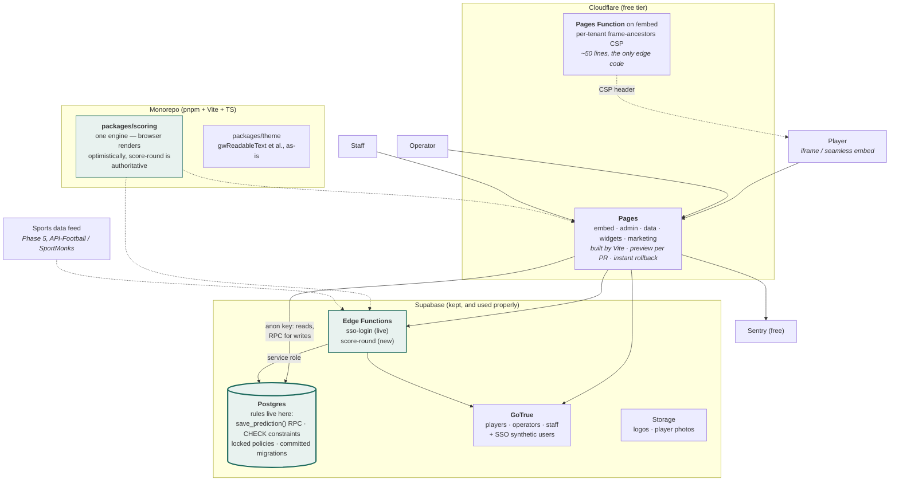
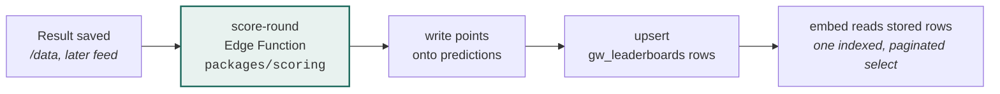
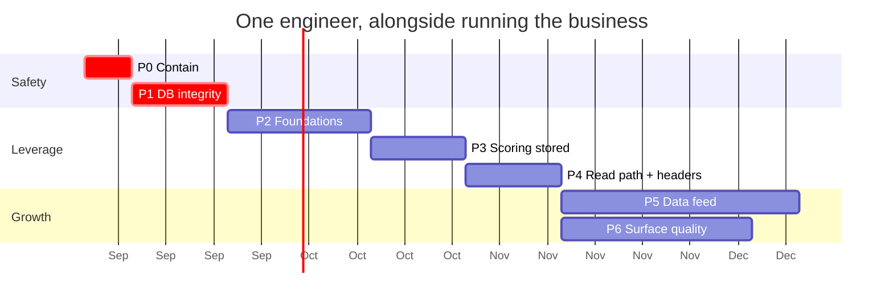

# Gameweek — Target Architecture (v2)

**Status:** proposal, revised · **Date:** 2026-08-28 · **Baseline:** `a06b055` (v1 was written against `f25d78a`)
**Companion docs:** [CODEBASE-ASSESSMENT.md](./CODEBASE-ASSESSMENT.md) · [ARCHITECTURE.md](./ARCHITECTURE.md) · [SSO.md](./SSO.md) · task breakdown in [REARCHITECTURE-PHASES.md](./REARCHITECTURE-PHASES.md)

> Nothing in this document has been implemented. It is a plan. Findings referenced as C-n / H-n / M-n / L-n are from the assessment §18.

---

## 1. Why a v2

The v1 diagnosis stands: every critical finding is the same root cause — **there is no trusted place to enforce a rule**. What changed is that the day after v1 was written, the codebase itself demonstrated where the cheapest trusted places are:

- The **RLS PII fix** closed C-3 with pure SQL, was validated against a local Postgres fixture, and was verified live — no new infrastructure, no downtime.
- The **SSO Edge Function** shipped for a real prospect. It is exactly the "small trusted server-side component" v1 said the product needed, and it works.
- **Private leagues and Portuguese shipped in the same week** — feature velocity on the current architecture is real revenue-side work that any long migration would freeze.

v1 concluded the product needed a new API tier (Hono on Workers) and then a platform migration (Neon, Better Auth, Drizzle, R2). v2 keeps v1's goal and drops most of its construction: **the server Gameweek needs already exists — it is Postgres, plus the Edge runtime for what SQL cannot express.** The three v1 investments that just paid off (RLS, Edge Functions, GoTrue sessions for SSO) are precisely the three things v1 planned to replace. Replacing them now would be paying twice.

What v2 changes, in one table:

| | v1 | v2 | Why |
|---|---|---|---|
| Write rules (deadline, identity) | New Hono API on Cloudflare Workers | **Postgres functions + constraints + revoked direct writes** | No path around the database; zero new services; C-1 closes in week ~2, not month ~2 |
| Scoring | API + Queues later | **One `score-round` Edge Function** + shared TS scoring package | Same pattern as the already-deployed `sso-login` |
| Auth | Migrate GoTrue → Better Auth | **Keep GoTrue** | SSO now mints GoTrue sessions (`generateLink`/`verifyOtp`); no per-MAU pricing problem exists; migration = pure risk |
| Database | Migrate to Neon | **Keep Supabase Postgres** | It *is* Postgres; the "peeling is easy" argument is the argument for deferring, not doing |
| Schema | Drizzle ORM | **Supabase CLI SQL migrations** | Without a custom API server there is no TS query layer to feed an ORM; plain versioned SQL is the boring standard |
| Cache | Workers KV, versioned keys | **Materialised leaderboard table first**; edge cache when triggered | A single indexed read of precomputed rows is cheap at this scale; KV solves a load we don't yet have |
| Storage | Migrate to R2 | Keep Supabase Storage; Cloudflare CDN caches it | Egress on small logos behind a CDN is noise |
| Frontend build, tests, hosting, errors | Vite + TS, Vitest/Playwright, Cloudflare Pages, Sentry | **Unchanged** | These were right |

Net effect: the security-and-cost outcome v1 reached at ~week 16 arrives at ~week 9–10, with two fewer vendors and one fewer codebase.

---

## 2. Design principles

Unchanged from v1, restated because every v2 decision was tested against them:

| # | Principle | Why it binds here |
|---|---|---|
| P1 | **One engineer must be able to operate the whole thing on a Sunday.** | 466 of 467 commits are by one person. |
| P2 | **Infrastructure cost per tenant must round to zero.** | Revenue is capped at $150/month per operator. |
| P3 | **Never break a live customer.** | Every phase ships incrementally and is reversible. The seamless-embed postMessage protocol and the SSO flow are now **public contracts** operators have integrated — they must survive every phase unchanged. |
| P4 | **Trust nothing the player can edit.** | The browser is a rendering surface, not a rules engine. |
| P5 | **Prefer boring, portable technology.** | Postgres, SQL, TypeScript, HTTP. |
| P6 | **Every layer removed is worth more than every layer added.** | v2 exists because v1 flunked its own principle here. |
| P7 | **Defer with a named trigger, not "later".** | See §8. |

---

## 3. Target architecture



### Where each kind of rule lives

This is the heart of v2. Instead of one new API tier enforcing everything, each rule goes to the cheapest layer that the player cannot bypass:

| Rule | Enforced by | Mechanism |
|---|---|---|
| Prediction before kick-off (C-1) | **Postgres** | `save_prediction()` RPC whose `WHERE` uses database time; direct `INSERT`/`UPDATE` on `gw_predictions` revoked |
| Username charset / length / uniqueness (C-4, H-7) | **Postgres** | `CHECK` constraint + the existing unique index; RPC sets `username` from `gw_players`, never from client input |
| Tenant immutability (`client_key`) (H-7) | **Postgres** | trigger + column-restricted update policy |
| Who may write the global sports DB (C-2) | **Postgres** | `gw_admins` membership predicate in policy |
| Who sees predictions before lock (H-6) | **Postgres** | select policy: own rows always, others' rows only after event lock |
| Points (§5.2 of assessment) | **Edge Function** | `score-round` runs `packages/scoring`, writes `points` + leaderboard rows |
| SSO identity (already live) | **Edge Function** | `sso-login`, unchanged |
| Who may iframe an operator's embed (H-3) | **Cloudflare Pages Function** | per-tenant `frame-ancestors` from `gw_operators_public.domains` |
| Rendering, optimistic feedback, theming | Browser | as today |

Postgres functions are not a scattered second codebase: there are **five or six of them total** (save prediction, register player, join/leave league, enter result guard), they live in committed migration files, and they are testable with the local-Postgres fixture approach the PII fix already proved.

### Repository shape

```
apps/
  embed/          player app            (Vite + TS)
  admin/          operator dashboard    (Vite + TS)
  data/           staff data manager    (Vite + TS)
  widgets/        embeddable widgets    (Vite + TS)
  marketing/      static pages
packages/
  scoring/        pure scoring engine — browser (optimistic) + score-round (authoritative)
  theme/          gwReadableText / gwApplySemantics, extracted as-is
  i18n/           I18N + RULES_HTML tables (en·tr·de·pt), one place
supabase/
  functions/      sso-login (exists) · score-round (new)
  migrations/     committed, additive SQL — the schema of record
embed.js          seamless-embed loader — a public contract, versioned carefully
```

`demo/` disappears as a fork: it becomes `apps/embed` with a mock data adapter, deleting ~4,400 drifting duplicate lines (M-3). `packages/scoring` remains the most important line: today scoring exists twice in `embed`, again in `demo`, and is untestable; extracted, the server runs it authoritatively and the client runs the same module optimistically.

---

## 4. The three mechanisms that fix everything

### 4.1 The database-enforced write

v1 proposed this SQL guard but wrapped it in a new API service. The service is unnecessary — Postgres can expose it directly as an RPC that `supabase-js` already knows how to call:

```sql
create function save_prediction(p_competition_id text, p_round_id text,
                                p_event_id text, p_prediction jsonb)
returns text language plpgsql security definer as $$
declare v_player gw_players; v_id text;
begin
  select * into v_player from gw_players
    where auth_id = auth.uid()
      and client_key = (select client_key from gw_competitions where id = p_competition_id);
  if not found then raise exception 'not_registered'; end if;

  insert into gw_predictions (player_id, client_key, competition_id, round_id,
                              event_id, username, prediction)
  select v_player.id, v_player.client_key, p_competition_id, p_round_id,
         e.id, v_player.username, p_prediction
  from   gw_dm_events e
  where  e.id = p_event_id
    and  now() < e.kickoff_at - interval '30 minutes'   -- database time
  on conflict (player_id, competition_id, event_id)
    do update set prediction = excluded.prediction
  returning id into v_id;

  if v_id is null then raise exception 'locked'; end if;
  return v_id;
end $$;

revoke insert, update on gw_predictions from anon, authenticated;
```

Zero rows selected means the deadline passed — the client shows "locked", and **there is no code path from any client that writes a late prediction.** Clock skew and a lying browser are both irrelevant. The same call also fixes username spoofing structurally: the denormalised `username` comes from the player row, not the request.

Prerequisite worth naming: `kickoff` is currently free-text with a browser-side parser that has already caused production bugs (M-12). Phase 1 adds `kickoff_at timestamptz`, backfills it, and makes `/data` write it — the rule above needs a real timestamp to compare against.

v1's claim that "RLS can't express before-kickoff" was wrong — a `WITH CHECK` subquery can — but the RPC is still the better home: one place, clear error codes, atomic, and it sets server-derived columns.

### 4.2 Scoring becomes a stored fact

Unchanged from v1 in substance, simplified in machinery. When a result is entered (by staff today, by feed or operator later), the caller invokes `score-round`:



- The browser keeps computing points optimistically for instant feedback — same module, so the numbers agree.
- Leaderboards stop being "score every prediction of every player in every viewer's browser" and become a paginated read of precomputed rows. That alone removes the biggest CPU and egress multiplier.
- Auditability comes free: stored points beside the raw prediction means disputes are explainable from data and a scoring-rule change doesn't rewrite history.
- No Queues, no KV yet. A round is a few thousand predictions; an Edge Function scores that inline in well under its budget. Both remain named triggers in §8.

### 4.3 Tenant-scoped reads and per-tenant headers

- **Reads (H-2):** the embed already knows its rounds' `event_ids` — fetch only those events and only the teams they reference, with explicit columns, instead of `select * limit 10000` of the whole platform. Replace the `teamById` linear scan with a `Map`. This needs no server change at all; it is query discipline, and it turns per-pageview cost from "platform-sized" to "tenant-sized".
- **Headers (H-3, L-7):** moving static hosting to Cloudflare Pages gives CSP/HSTS everywhere; a ~50-line Pages Function on `/embed` reads the operator's `domains` and emits `Content-Security-Policy: frame-ancestors` — the allowlist operators already maintain finally does something, and the SSO fail-open (SSO.md §10) gets closed in the same stroke.

---

## 5. Key decisions, and what was rejected

| # | Decision | Rationale | Rejected alternative |
|---|---|---|---|
| D1 | **Stay on Supabase** — Postgres, GoTrue, Edge Functions, Storage | Everything critical it does is standard Postgres or already-proven here (SSO, RLS fix). Exit stays a `pg_dump` away precisely *because* it's Postgres, so leaving is deferrable risk-free. SSO's GoTrue coupling makes leaving actively expensive now. | v1's Phase 4 (Neon + Better Auth + R2): ~4 weeks + the riskiest migration class (auth), for zero customer-visible value. Now a §8 trigger. |
| D2 | Rules in **Postgres functions/constraints**, not a new API tier | Un-bypassable, no new service, no secrets to move, testable with the proven local-fixture approach, and closes C-1 weeks earlier. Five or six functions, committed as migrations. | Hono on Workers (v1): a whole service + secret plumbing + second deploy pipeline to express rules SQL states in ten lines. Becomes worth it only at the §8 triggers. |
| D3 | Scoring in an **Edge Function** with a shared TS package | Scoring is config-driven JSON logic — wrong shape for plpgsql, right shape for the module the browser also uses. Same runtime and deploy path as `sso-login`. | Scoring in SQL (unmaintainable); scoring in a Workers API (needs D2's rejected tier). |
| D4 | **Cloudflare Pages in front, Supabase behind** | Pages: previews, rollback, headers, free. The only edge *code* is the frame-ancestors function. | GitHub Pages (no headers, no previews — the reason H-3/L-7 exist); full Workers platform (v1) — more than the job needs. |
| D5 | **Supabase CLI SQL migrations** as schema-of-record | `supabase/migrations/*.sql`, additive, replayable locally. Kills the stale-destructive-file problem (§5.4) with the vendor's own boring tool. | Drizzle (v1) — an ORM with no ORM consumer; hand-run SQL editor snippets (the status quo that caused the drift). |
| D6 | **Keep GoTrue** | No per-MAU billing problem exists (P2 satisfied); SSO depends on it; tenant-scoped player identity already works via `gw_players`. | Better Auth (v1) — re-implementing SSO and migrating live users to solve a problem we don't have. Clerk/Auth0 — still disqualified by pricing. |
| D7 | **Vite + TypeScript, no framework** (unchanged from v1) | A bundler unlocks modules, shared packages, tests, and killing the demo fork. The embed must stay small inside other people's pages. | React/Next — bundle cost and a rewrite for no needed capability. Staying build-less — the demo fork and untestable scoring are the price, and it's now too high. |
| D8 | Monorepo, pnpm workspaces (unchanged) | Justified almost entirely by `packages/scoring` + killing the fork. | Separate repos — reintroduces drift. |
| D9 | **Materialised leaderboard table** before any cache tier | Precomputed rows + pagination is a ~1ms indexed read. Edge caching is a §8 trigger with a number attached. | KV versioned keys (v1) — good design, premature; solves read volume we should be so lucky to have. |
| D10 | RLS stays on, as defence-in-depth *and* primary read-authz | Reads still go browser→PostgREST, so read policies remain load-bearing; write policies become the second lock behind revoked grants + RPCs. | Dropping RLS (loses the boundary reads depend on). |

---

## 6. Tooling: today → target

| Concern | Today | Target | Phase |
|---|---|---|---|
| Write rules | browser JS | Postgres RPCs + constraints + revokes | **1** |
| Schema management | stale destructive `.sql` + ad-hoc editor runs | Supabase CLI migrations, committed | **1** |
| Scoring | recomputed per viewer | `score-round` Edge Function + `points` column | 3 |
| Static hosting | GitHub Pages (whole repo published) | Cloudflare Pages, built artifact only | 2 |
| Build | none | Vite + TypeScript, pnpm workspaces | 2 |
| Tests | none | Vitest (scoring, theme, **RLS/RPC against local Postgres**) + Playwright smoke | 1–2 |
| CI | deploy-only | typecheck · unit · build · dup-declaration check, gating deploy | 2 |
| Error tracking | none | Sentry free tier, all apps | 2 |
| Uptime | none | free synthetic check on `/embed?client=demo` | 2 |
| Backups | Supabase automated (unverified) | verified + weekly offsite `pg_dump` via GitHub Action + **one restore drill** | 1 |
| Security headers | impossible | Pages headers + per-tenant `frame-ancestors` function | 2/4 |
| Sports data | manual typing | provider feed + reconciliation UI | 5 |
| Auth / DB / storage vendor | Supabase | **Supabase (unchanged)** | — |

---

## 7. Phases — summary

Full task breakdown with acceptance criteria: [REARCHITECTURE-PHASES.md](./REARCHITECTURE-PHASES.md). Effort is developer-weeks for one engineer alongside running the business.

| Phase | What | Effort | Closes |
|---|---|---|---|
| **0 — Contain** | Live-policy audit; `gw_dm_*` writes → admins; leagues RLS; XSS escape + username CHECK; deploy artifact allowlist (SQL files & `sso-test.html` off the public site); pin + SRI; delete duplicate functions; `.gitignore`; SSO origin fail-closed | ~1 wk | C-2, C-4(part), C-5, H-1, H-5, M-2, M-8, L-1, L-2 + new leagues/SSO gaps |
| **1 — Database integrity** | Supabase CLI migration baseline from live schema; `kickoff_at timestamptz`; **`save_prediction()` + revoked writes**; prediction read-gating; league membership → `player_id`; `client_key` immutable; backup verification + offsite dump + restore drill | ~2 wks | **C-1**, C-4(fully), H-6, H-7, M-12, §5.4 |
| **2 — Foundations** | pnpm + Vite + TS; extract `packages/scoring`+`theme`+`i18n` with tests-first; **kill the demo fork**; Cloudflare Pages + CI gate + Sentry + uptime; embed contract (`inline=1`, postMessage, SSO) preserved byte-for-byte | ~3 wks | M-1, M-3, M-14, L-6 |
| **3 — Scoring & leaderboards** | `score-round` Edge Function; `points` column; `gw_leaderboards` materialised rows; paginated leaderboard reads; optimistic client scoring from the same package | ~2 wks | §5.2, M-10(part) |
| **4 — Read path & headers** | Tenant-scoped event/team queries; explicit columns; `Map` lookup; parallel init (drop the 3s wait); per-tenant `frame-ancestors` Pages Function | ~1–2 wks | H-2, H-3, M-10, the §7.4 margin problem |
| **5 — Sports data feed** | API-Football / SportMonks; ingest via scheduled Edge Function (Supabase cron); reconciliation UI; operators enter own results; delete dead admin modal | ~4–5 wks | H-4, the manual-entry bottleneck |
| **6 — Surface quality** | a11y pass; GDPR delete/export + consent timestamping; SEO fixes; mode registry, delete legacy modes; i18n date locales | ~3–4 wks, parallelisable | M-4..M-7, M-13, M-15, L-4, L-5 |

**Roughly 9–10 weeks to a secure, tested, observable, cheap-to-serve system (Phases 0–4).** Phases 5–6 are product investment on top, unchanged from v1. If only part gets done: **do 0 and 1** — after them the product's central promise (a prediction is made before kick-off) is true, the data is private, and nothing is misrepresenting itself to customers.



---

## 8. Deferred until triggered

Planned, costed, explicitly not now. Each trigger is checkable evidence, not anxiety.

| Capability | Build it when | Rough cost |
|---|---|---|
| **Leave Supabase** (Neon/self-hosted PG, Better Auth, R2) | Supabase pricing, reliability, or a customer requirement actually hurts — measured, not feared. Exit remains `pg_dump` + re-pointing; SSO re-implementation is the one real cost, so decide *then*. | 3–4 wks |
| **API tier** (Hono on Workers) | A partner/public API is requested, or rate-limiting/shaping needs exceed what Postgres quotas + Cloudflare can do | 2–3 wks |
| Edge caching (KV / Cache API, versioned keys) | Leaderboard/fixture origin reads become a visible cost or latency line item | 1 wk |
| Queues / async scoring | A single round's scoring exceeds the Edge Function budget | 1 wk |
| R2 for media | Storage egress becomes a real invoice line despite CDN caching | days |
| Rate limiting beyond auth defaults | Abuse observed on writes (RPCs make per-player quotas a `CHECK`-style addition) | days |
| Audit log | An operator disputes a leaderboard, or compliance asks | 1 wk |
| SSO/SAML for operators, SOC 2, multi-region, warehouse/BI, on-call | Same triggers as v1 | as v1 |
| Kubernetes, microservices, GraphQL, event sourcing, feature-flag SaaS, frontend framework | **Probably never** | — |

---

## 9. Cost

| | Today | Target (P0–P4) | + feed (P5) |
|---|---|---|---|
| Hosting | GitHub Pages — free | Cloudflare Pages — free | — |
| Backend | Supabase Pro ~$25/mo + growing egress | Supabase Pro ~$25/mo, egress collapsed by P3+P4 | — |
| Edge code | — | included in Pages free tier | — |
| Errors / uptime | none | free tiers | — |
| Sports feed | staff time | — | ~$30–150/mo, replaces labour |
| **Total** | **~$25/mo + rising egress + data-entry labour** | **~$25–30/mo, flat** | **~$60–180/mo** |

v2 is cheaper than v1's target (~$30–60/mo) because nothing new is metered; the platform bill barely changes while the per-pageview egress multiplier (whole-platform fixture downloads, per-viewer scoring) is removed.

---

## 10. What we are deliberately not doing

Everything on v1's list (no Kubernetes, no microservices, no GraphQL, no event sourcing, no staging environment, no IaC, no feature-flag SaaS, no framework migration, no SOC 2 until a deal needs it) — plus, new in v2:

- **No platform migration.** Not Neon, not Better Auth, not R2, not Drizzle. Each is a §8 trigger.
- **No new API service.** Six Postgres functions and two Edge Functions are the entire server surface.
- **No cache tier.** Materialised rows first; measure before caching.
- **No breaking the embed contract.** `embed.js`, the postMessage protocol, the SSO flow, and existing iframe URLs survive every phase unchanged.

---

## 11. Risks

| Risk | Likelihood | Impact | Mitigation |
|---|---|---|---|
| Revoking direct `gw_predictions` writes breaks live players | Medium | High | Ship RPC first, migrate the client, watch Sentry, revoke last; never on a matchday; revoke is one `GRANT` to revert. |
| `kickoff_at` backfill mis-parses legacy text dates | Medium | High | Backfill script with a report of unparseable rows for manual review *before* the rule flips to the new column; keep old column until verified. |
| Phase 2 refactor stalls and blocks feature work | Medium | Medium | Timebox 3 weeks; repo stays shippable every commit; `allowJs`, no strict mode yet; demo-fork kill is the bulk — do it last within the phase. |
| Business logic split across SQL + TS confuses future work | Low | Medium | The split is principled (§3 table: *rules* in SQL, *computation* in TS) and documented; six functions, one file each, tested. |
| Sports feed IDs don't match hand-entered data | High | Medium | Reconciliation UI before automated ingest; manual override permanently (unchanged from v1). |
| One engineer, ~10 weeks | High | High | P0–P1 alone end the unsafe state in ~3 weeks; every later phase can slip without reopening it. |
| Scope creep back toward v1's platform build | Medium | Medium | This document is the scope; §8 is where the ideas go. |

---

## 12. Open questions

Carried from v1 where still relevant, minus the ones v2 resolves:

1. **How many operators are live, and what is matchday peak traffic?** Sizes P4's urgency and validates D9 (no cache tier yet).
2. **Is Stripe intentionally in test mode?** (H-5 — still unverified.)
3. **Which sports must the feed cover at launch?** Football is cheap; volleyball/esports are not.
4. **Has `gw_players` ever been enumerated pre-fix?** The leak is closed, but if it was exploited, GDPR disclosure obligations may exist (assessment §15).
5. **Is a second engineer plausible within six months?** Changes what gets automated vs documented.

---

*Proposal only. v1 of this document (Hono API tier + full Supabase exit) is superseded; its analysis of findings and its rejected-alternatives reasoning remain correct and are referenced above rather than repeated.*
