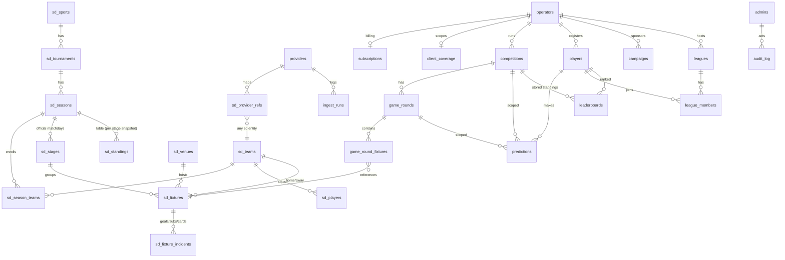

# Target Database Schema — Redesign (2026-08-31)

Companion to [schema-review-2026-08-31.md](./schema-review-2026-08-31.md): the review says what
is wrong with the current schema; this document says what the schema should look like when the
remediation is done, and how to get there without breaking a live product.

**Design goals** (from the review + owner direction): true multi-tenancy at high customer/user
volume; a provider-agnostic sports-data layer (SportMonks first, more providers later, with
cross-provider verification); clean customer/billing modelling; first-class operational logs;
referential integrity everywhere; RLS that scales; indexes matched to the real query shapes.

**Hard constraints respected throughout:**
- The public API surface must not break: `client_key` in embed URLs, competition ids in `?comp=`,
  and PostgREST table names used by shipped pages. Renames are therefore *logical* here — the
  migration keeps wire-compatible names/views wherever a rename buys nothing.
- Supabase + PostgREST + RLS remains the platform. No second database, no per-tenant databases —
  `operator_id` scoping + RLS is the right multi-tenancy model at this product's scale.
- Everything lands via the established discipline: one CLI migration per step, docker test first,
  independently deployable, live-verified.

---

## 1. The three layers



- **Sports data (`sd_*`)** — the shared truth about the sporting world. Written only by platform
  admins and the ingest worker. Read by everyone (scoped per tenant via coverage + the tenant
  junction, not by blanket `SELECT true`).
- **Tenant** — everything owned by one operator, always carrying `operator_id`. This is the
  high-volume layer and the RLS boundary.
- **Ops** — providers, run logs, admin audit. Platform-admin/service only.

---

## 2. Key strategy (the "text keys" answer)

| Concern | Rule |
|---|---|
| Internal identity & joins | `bigint GENERATED ALWAYS AS IDENTITY` on high-churn tables (predictions, leaderboards, fixtures, incidents); `uuid` where rows bind to auth identities (players, operators, admins) |
| Public handles (URLs, embeds, API) | Short `text` codes kept as **UNIQUE columns, not PKs** — `operators.client_key`, `competitions.public_code`. Server-generated, format-CHECKed (`~ '^[a-z0-9_-]{2,40}$'`) |
| Legacy text ids (`ev…`, `tm…`, `c…`) | Preserved as `legacy_id text UNIQUE` during migration so every existing URL and stored reference keeps resolving; new rows get identity PKs only |
| Foreign keys | Every reference is a real FK. Tenant chain: `ON DELETE CASCADE` from operators down (makes GDPR/tenant-offboarding one statement). Sports layer: `ON DELETE RESTRICT` (a team in use must not vanish) |
| Composite tenant indexes | Lead with `operator_id bigint` (8 bytes) instead of `client_key text` — roughly halves index width on the hot tables |

---

## 3. Layer 1 — Sports data (`sd_*`)

Current equivalents: `gw_dm_teams/players/events/tournaments` + the `seasons` jsonb megablob,
which this layer **decomposes into rows** (review finding 2.2).

```sql
sd_sports        (id smallint PK, key text UNIQUE)            -- 'football', 'basketball', …
sd_venues        (id bigint PK, name text, city text, country text, name_i18n jsonb)
sd_teams         (id bigint PK, legacy_id text UNIQUE,        -- 'tm…' compat
                  sport_id → sd_sports, name text, short text, color text, logo text,
                  country text, name_i18n jsonb,
                  fd_home smallint, fd_away smallint,
                  created_at, updated_at)
sd_players       (id bigint PK, legacy_id text UNIQUE, team_id → sd_teams,
                  full_name text, name_i18n jsonb, position text CHECK (…),
                  jersey_number smallint, nationality text, birthday date,
                  height_cm smallint, photo_url text, created_at, updated_at)
sd_tournaments   (id bigint PK, legacy_id text UNIQUE, sport_id → sd_sports,
                  name text, name_i18n jsonb, country text, type text CHECK (…), color text)
sd_seasons       (id bigint PK, tournament_id → sd_tournaments,
                  key text,                                    -- '2026-27' (blob key compat)
                  starts_on date, ends_on date, is_current bool,
                  UNIQUE (tournament_id, key))
sd_season_teams  (season_id → sd_seasons, team_id → sd_teams, PK (season_id, team_id))
sd_stages        (id bigint PK, season_id → sd_seasons,        -- official matchday/stage
                  label text, sort int, UNIQUE (season_id, sort))
sd_fixtures      (id bigint PK, legacy_id text UNIQUE,         -- 'ev…' compat
                  season_id → sd_seasons NULL,                 -- null = not yet organised
                  stage_id → sd_stages NULL,
                  home_team_id → sd_teams, away_team_id → sd_teams,
                  venue_id → sd_venues NULL,
                  kickoff_at timestamptz, status text CHECK (status IN
                    ('upcoming','live','completed','postponed','cancelled')),
                  result jsonb,          -- {h,a, home_xg, …} small + shape-CHECKed
                  lineup jsonb,          -- display blob; XI stays jsonb (render-only)
                  created_at, updated_at,
                  CHECK (home_team_id <> away_team_id))
sd_fixture_incidents (id bigint PK, fixture_id → sd_fixtures,
                  kind text CHECK (kind IN ('goal','own_goal','sub','card','mvp')),
                  minute smallint, player_id → sd_players NULL, player_in_id → sd_players NULL,
                  team_id → sd_teams, sort int)                -- replaces scorers jsonb
sd_standings     (id bigint PK, season_id → sd_seasons,
                  stage_id → sd_stages NULL,                   -- NULL = current table;
                                                               -- set = snapshot after that matchday
                  rank smallint, team_id → sd_teams NULL, display_name text,
                  played smallint, w smallint, d smallint, l smallint,
                  gf smallint, ga smallint, pts smallint, zone text,
                  updated_at, UNIQUE NULLS NOT DISTINCT (season_id, stage_id, rank))
```

Why it looks like this:
- **`sd_standings` with a nullable `stage_id`** gives both the current table (what the widget
  shows) *and* per-round snapshots ("table after Round 3") — the owner-requested feature the
  jsonb blob could never support. The ingest writes the current row set every sync and freezes a
  snapshot when a stage completes.
- **`sd_fixture_incidents` as rows** replaces the `scorers` jsonb: first-goal-scorer and
  first-sub bonus questions become indexed queries instead of client-side array walks, and a
  future "top scorers" widget reads it directly.
- **`lineup` stays jsonb** deliberately: it is a display blob consumed whole, never queried into.
  Same for `result` — small, whole-value, shape-CHECKed
  (`CHECK (result IS NULL OR (result ? 'h' AND result ? 'a'))`).

### Provider mapping (replaces `provider_ids` jsonb columns)

```sql
providers        (id text PK CHECK (id ~ '^[a-z0-9_]+$'), name text, base_url text,
                  enabled bool, token_ref uuid → vault.secrets,  -- token OUT of the table
                  config jsonb, created_at, updated_at)
sd_provider_refs (provider_id → providers,
                  entity text CHECK (entity IN ('team','player','tournament','season',
                                                'fixture','venue','stage')),
                  entity_id bigint,                       -- the sd_* row
                  external_id text,                       -- the provider's id
                  payload jsonb,                          -- last raw provider snapshot
                  confidence text CHECK (confidence IN ('admin','auto')),
                  synced_at timestamptz,
                  PK (provider_id, entity, external_id),
                  UNIQUE (provider_id, entity, entity_id))
```

This is what makes "SportMonks now, more later, cross-check between them" real: one row per
(provider, entity) mapping, in both directions unique, with the provider's last payload kept for
diffing. **Cross-provider verification** becomes a query: fixtures where two providers' payloads
disagree on `result` → flag for review instead of blind overwrite. The jsonb `provider_ids`
columns are dropped once refs are backfilled.

---

## 4. Layer 2 — Tenant

```sql
operators        (id bigint PK, client_key text UNIQUE CHECK (format), auth_id uuid → auth.users,
                  company_name, email UNIQUE, language, domains text[],
                  branding jsonb,                  -- colors/logo (today: loose columns)
                  sso_secret_ref uuid → vault.secrets,
                  plan text, created_at, updated_at)
subscriptions    (operator_id → operators UNIQUE, stripe ids, status, …)
client_coverage  (operator_id → operators PK, tournament_ids bigint[], team_ids bigint[])
competitions     (id bigint PK, legacy_id text UNIQUE,        -- 'c…' compat (?comp= URLs)
                  operator_id → operators, name, mode text CHECK (mode IN
                    ('score','betting','ranking','lineup')),
                  status text CHECK (…), color,
                  config jsonb,                   -- mode config (scoring/markets/…); one column,
                                                  -- shape-checked per mode by trigger
                  sort int, created_at, updated_at)
game_rounds      (id bigint PK, legacy_id text UNIQUE, competition_id → competitions,
                  operator_id → operators,        -- denormalised tenant key for RLS/index locality
                  label, status CHECK (…), sort int, prizes jsonb,
                  ranking_teams jsonb,            -- ranking-mode round config
                  created_at, updated_at)
game_round_fixtures (round_id → game_rounds, fixture_id → sd_fixtures, sort int,
                  PK (round_id, fixture_id))      -- replaces gw_rounds.event_ids text[]
players          (id uuid PK, operator_id → operators, auth_id uuid → auth.users,
                  username text, email text, created_at,
                  UNIQUE (operator_id, username))
predictions      (id bigint PK, operator_id → operators, player_id → players,
                  competition_id → competitions, round_id → game_rounds,
                  fixture_id → sd_fixtures NULL,  -- NULL for round-keyed modes (ranking/lineup)
                  prediction jsonb, points int CHECK (points IS NULL OR points >= 0),
                  submitted_at, updated_at,
                  UNIQUE NULLS NOT DISTINCT (player_id, competition_id, round_id, fixture_id))
leaderboards     (as today, but operator_id bigint + FKs to competitions/rounds/players)
leagues          (id uuid PK, operator_id → operators, name, code, created_by → players)
league_members   (league_id → leagues, player_id → players, joined_at,
                  PK (league_id, player_id))      -- username becomes display-only (review 2.8)
campaigns        (operator_id → operators, …)
```

Notable decisions:
- **`predictions.fixture_id` is a real column** instead of overloading `event_id` with
  `round_id + '_ranking'` sentinels (the lineup/ranking gotcha that has bitten this codebase
  repeatedly). Round-keyed modes use `fixture_id NULL`; the NULLS-NOT-DISTINCT unique keeps
  one-per-round.
- **`operator_id` denormalised onto every tenant table** (even where derivable through the FK
  chain): it is the RLS predicate and the leading index column — deriving it per row through
  joins is exactly the per-row-policy trap the review flagged.
- **Branding/config as jsonb**: operator branding and per-mode competition config are
  read-whole-write-whole values — jsonb is correct there; the megablob problem was *mixed
  concerns*, not jsonb itself.

### RLS blueprint (applies to both layers)

```sql
-- helpers, called ONCE per statement via initplan
CREATE FUNCTION app.current_operator_id() RETURNS bigint STABLE …   -- from JWT → operators
CREATE FUNCTION app.current_player_ids() RETURNS SETOF uuid STABLE …
CREATE FUNCTION app.is_platform_admin() RETURNS boolean STABLE …

-- every policy follows one of four templates:
USING (true)                                            -- public game data (competitions, leaderboards)
USING (operator_id = (SELECT app.current_operator_id()))-- operator-owned
USING (player_id IN (SELECT app.current_player_ids()))  -- player-owned
USING ((SELECT app.is_platform_admin()))                -- ops layer
```

One permissive policy per (table, verb, role) — merged with `OR`, never stacked. Sports-layer
reads stop being `SELECT true` once the embed reads through `game_round_fixtures` (only fixtures
your rounds reference) — closing review finding 2.6 at the schema level.

### Index plan (tenant hot paths)

```sql
predictions   (operator_id, competition_id, round_id)         -- score-round + leaderboards
predictions   (player_id, competition_id)                     -- "my picks"
leaderboards  (operator_id, competition_id, round_id, points DESC)  -- paginated read (3.5)
game_round_fixtures (fixture_id)                              -- "which rounds use this fixture"
sd_fixtures   (kickoff_at) WHERE status <> 'completed'        -- ingest live/stale windows
sd_provider_refs (provider_id, entity, external_id)           -- feed lookups (is the PK)
players       (operator_id, username)                         -- login/uniqueness (exists today)
```

`predictions` gets `fillfactor = 90` (scoring updates stay HOT); partitioning by
`hash(operator_id)` is a **decision point at ~50M rows**, not a day-one structure.

---

## 5. Layer 3 — Ops

```sql
providers        (above — token moved to Vault)
ingest_runs      (id, run_at, provider_id → providers, trigger_source, initiated_by,
                  ok, duration_ms, stats jsonb, log jsonb, error)
score_runs       (id, run_at, initiated_by, operator_id NULL, competition/round refs,
                  ok, duration_ms, counters…, error)
audit_log        (id bigint, at timestamptz, actor text,       -- NEW: admin/operator mutations
                  actor_role text CHECK (…), operator_id NULL,
                  entity text, entity_id text, action text CHECK (…),
                  diff jsonb)                                   -- written by triggers on
                                                                -- operators/competitions/sd_* writes
api_usage        (provider_id, day date, calls int, PK (provider_id, day))
                                                                -- rollup from ingest stats; the
                                                                -- budget dashboard for the 2000/mo cap
```

Retention (pg_cron, one job): `ingest_runs`/`score_runs`/`audit_log` > 90 days,
`cron.job_run_details`/`net._http_response` > 7 days, `api_usage` kept 2 years.

---

## 6. Migration path (strangler, not big bang)

Sequenced to ride the existing rearchitecture phases; every step is independently shippable and
keeps the live product byte-compatible at the API surface.

| Step | What | Unlocks | Ships with |
|---|---|---|---|
| M1 | Review roadmap R1–R5 (policies, index cleanup, FKs on *existing* columns, CHECKs, retention) | Integrity + RLS perf on the current shape | now |
| M2 | `sd_provider_refs` + backfill from `provider_ids` jsonb; ingest/mapping UI switch to it; drop jsonb columns | Multi-provider + cross-check foundation | provider work |
| M3 | `game_round_fixtures` junction backfilled from `event_ids[]`; embed/score-round read the junction (array column kept in sync by trigger until all readers move) | Tenant-scoped fixture reads (4.1), FK integrity on rounds | Phase 4.1 |
| M4 | `sd_seasons`/`sd_season_teams`/`sd_stages`/`sd_standings` extracted from the seasons blob; /data + widgets read tables; blob becomes generated/legacy then dropped | Kills the megablob; per-round standings snapshots | after 3.5 cutover |
| M5 | `operator_id bigint` added alongside `client_key` on tenant tables, FK'd, backfilled, indexes re-led; RLS switches to `current_operator_id()`; `client_key` remains the public handle | Narrow indexes, cascade offboarding, clean tenancy | Phase 4 |
| M6 | `league_members` re-key to `player_id`; predictions get `fixture_id` (sentinel `event_id` retired); `username` becomes display-only | Rename-safe identity | Phase 6 window |
| M7 | Vault for provider tokens + sso_secret; `audit_log` triggers; `api_usage` rollup | Secrets + full audit story | Phase 6 |
| M8 | `sd_fixture_incidents` from `scorers` jsonb; sd table renames/views where still worth it | Queryable match events | with lineup-mode revival |

Rules for every step: dual-write or trigger-sync during transition, readers move before writers,
old columns dropped only after a full release cycle with the shadow quiet — the same pattern that
made the leaderboard cutover safe.

---

## 7. What this buys at volume

- A tenant's entire footprint is one FK cascade — export, delete, or restore a customer by
  `operator_id` (GDPR 6.2 becomes trivial).
- Every hot query is a leading-`operator_id` (or fixture-window) index scan; no policy evaluates
  anything per row.
- The feed can ingest from N providers into one truth layer, disagreements surface as data
  instead of overwrites, and the API budget is a table you can chart.
- Standings history, incident queries, and "which rounds use this fixture" — product features the
  blob model structurally could not answer — become one-line SQL.
